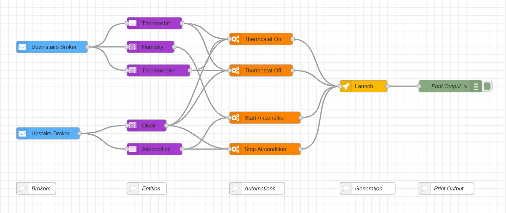

# Example 1

## Description
This is an example simulating a house with the following:
- Brokers: an Upstairs and Downstairs broker
- Entities: Thermostat, Humidity, Thermometer, Clock, Aircondition
- Automations: To adjust the Thermostat and Aircondition

## Instructions:
1. Install the node-red-contrib-ha-auto extension to Node-RED
2. Download and import flow.js to Node-RED
3. Configure the MQTT node at the end of the flow with the server that the HA-Auto backend is listening on.
4. Deploy the flow. You can see the HA-Auto script being sent via the MQTT server using a utility like MQTT Explorer
or by inspecting msg.payload{} after the generate node in the Node-RED flow.